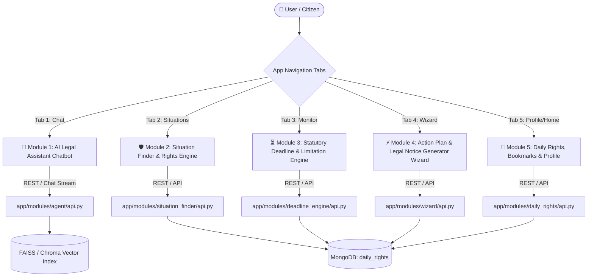

# 🏛️ LegalAce — Full System Architecture & 5-Module Technical Reference

**LegalAce** is a full-stack, AI-powered citizen legal assistant built specifically for the Indian Legal System. It translates complex Indian statutes (IPC, CrPC/BNSS, Consumer Protection Act, RERA, NI Act, Model Tenancy Act, Labour Laws) into plain-English rights, interactive action blueprints, advocate-grade legal notice generation, and statutory deadline monitoring.

---

## 🛠️ Global Technology Stack

| Layer | Technologies & Frameworks | Key Responsibilities |
|---|---|---|
| **Frontend Core** | React (TypeScript), Vite, Vanilla CSS | Single-page application, custom mobile-friendly design system, glassmorphism, zero external UI libraries. |
| **Speech & Media** | Web Speech Synthesis API, Browser Print Engine | Native offline Female/Young-Girl Text-to-Speech audio reader, A4 multi-page PDF generation engine. |
| **Backend API** | Python 3.10+, FastAPI, Uvicorn | High-performance async REST APIs, CORS middleware, strict Pydantic schemas. |
| **AI / LLM Engine** | LangChain, LangGraph, OpenAI / Gemini, RAG Vector Search | Context-aware legal agent tool execution, dynamic scenario generation, legal notice drafting. |
| **Database Layer** | MongoDB (Motor AsyncIOMotorClient) | Document store for situations, limitation rules, wizard scenarios, daily rights, user bookmarks, and chat history. |

---

## 🧭 Architecture & Module Connection Diagram



---

## 📦 Detailed Breakdown of the 5 Core Modules

---

### 🤖 Module 1: AI Legal Assistant & Floating Chatbot
* **Primary Role**: Conversational legal Q&A assistant and interactive guide for instant legal queries.
* **Frontend Location**: [ChatbotTab.tsx](file:///c:/Projects/LegalAce/frontend/src/modules/chatbot/ChatbotTab.tsx) & [FloatingChatWidget.tsx](file:///c:/Projects/LegalAce/frontend/src/modules/chatbot/FloatingChatWidget.tsx)
* **Backend Location**: `backend/app/modules/agent/` (`api.py`, `agent.py`, `tools.py`)

#### Key Features:
1. **Conversational Legal QA**: Answers queries on Indian civil, criminal, labour, and consumer law using plain-English explanations.
2. **Context-Aware Citation**: Automatically attaches relevant IPC / CrPC / Act citations with expandable summaries.
3. **Floating Floating Widget**: Accessible from anywhere in the app via a floating action button (`FloatingChatWidget.tsx`).
4. **Chat History Persistence**: Maintains multi-turn conversation logs in MongoDB and local storage.

#### Tech & Data Flow:
* **Frontend**: React state `messages`, Markdown rendering, auto-scrolling chat window.
* **Backend Endpoint**: `POST /api/v1/agent/chat`
* **Under the Hood**: Uses LangChain ReAct agent + custom vector search tool over Indian statutory corpus.

---

### 🛡️ Module 2: Situation Finder & Rights Engine
* **Primary Role**: Situation-first legal knowledge repository mapping everyday human problems directly to rights, laws, and action steps.
* **Frontend Location**: [SituationFinderTab.tsx](file:///c:/Projects/LegalAce/frontend/src/modules/situation_finder/SituationFinderTab.tsx) & [situation_finder.css](file:///c:/Projects/LegalAce/frontend/src/modules/situation_finder/situation_finder.css)
* **Backend Location**: `backend/app/modules/situation_finder/` (`api.py`, `service.py`, `models.py`)

#### Key Features:
1. **13 Specialized Legal Categories**:
   - `Employment`, `Housing`, `Consumer Rights`, `Banking & Finance`, `Cyber Crime`, `Traffic Rules`, `Women Rights`, `Education`, `Cheque Bounce & Debt`, `RTI & Public Service`, `RERA Real Estate`, `Insurance & Health`, `Family & Support`.
2. **4-Pillar Action Blueprint**:
   - **Statutory Rights**: Enforceable protections under Indian law.
   - **Action Steps**: Chronological numbered checklist.
   - **Expandable Law Citations**: Detailed act section breakdowns & remedy callouts.
   - **Urgency Deadlines**: Expiry warnings.
3. **Official Portals & Helplines Hub**:
   - Clickable web portal links (`e-Daakhil`, `Cybercrime.gov.in`, `RERA`, `SHe-Box`, `RTI Online`) and direct telephone dial buttons (`1915`, `1930`, `1800-180-5522`, `14448`, `15100`).
4. **Multilingual Voice Assist (Female / Young Girl Tone)**:
   - Built-in Web Speech Synthesis reader with configurable pitch (`1.3`) and female voice filtering (*Jenny*, *Aria*, *Samantha*, *Zira*).
5. **Multi-Page "Save PDF" Engine**:
   - Generates an A4 printable "Know Your Statutory Rights Guide" PDF sheet complete with LegalAce letterhead.

#### Tech & Data Flow:
* **Backend Endpoints**:
  - `GET /api/v1/situations/categories` (Category summaries + situation counts)
  - `GET /api/v1/situations` (Full scenario list)
  - `GET /api/v1/situations/{id}` (Single scenario details)
* **Database Collection**: MongoDB `situations` collection (seeded via `seed_situations.py`).

---

### ⏳ Module 3: Statutory Deadline & Limitation Engine ("Monitor")
* **Primary Role**: Helps citizens track legal limitation periods, calculate exact expiration dates under the Indian Limitation Act, 1963, and set reminder alerts.
* **Frontend Location**: [DeadlineDashboard.tsx](file:///c:/Projects/LegalAce/frontend/src/modules/deadline_engine/DeadlineDashboard.tsx)
* **Backend Location**: `backend/app/modules/deadline_engine/` (`api.py`, `service.py`, `limitation_calculator.py`)

#### Key Features:
1. **Limitation Period Calculator**:
   - Selects legal action type (e.g. *Cheque Bounce Notice - 30 days*, *Consumer Complaint - 2 years*, *Payment of Wages - 12 months*, *Labour Dispute - 3 years*).
   - User inputs cause of action date → system computes exact expiration date, remaining days, and urgency status (*Normal*, *Urgent*, *Expired*).
2. **Interactive Deadline Tracker**:
   - Allows users to save active deadlines to their personal dashboard.
3. **Reminders & Alert Notifications**:
   - Visual countdown badges and status progress bars.

#### Tech & Data Flow:
* **Backend Endpoints**:
  - `POST /api/v1/deadlines/calculate` (Calculates deadline from start date + rule ID)
  - `GET /api/v1/deadlines/rules` (Fetches all statutory limitation rules)
* **Database Collection**: MongoDB `limitation_rules` collection.

---

### ⚡ Module 4: Action Plan & Legal Notice Generator Wizard
* **Primary Role**: The core execution engine. Guides users through an interactive decision tree to build a custom Action Plan and generate printable, advocate-grade legal demand notices.
* **Frontend Location**: [WizardScreen.tsx](file:///c:/Projects/LegalAce/frontend/src/modules/wizard/WizardScreen.tsx) & [wizard.css](file:///c:/Projects/LegalAce/frontend/src/modules/wizard/wizard.css)
* **Backend Location**: `backend/app/modules/wizard/` (`api.py`, `service.py`, `scenarios_data.py`)

#### Key Features:
1. **Interactive Decision Tree Wizard**:
   - Asks 3 tailored questions (e.g. *"Did you vacate?"*, *"Do you have a written notice?"*, *"Was a cheque issued?"*) to branch logic dynamically.
2. **Custom AI Situation Input Card**:
   - Full-width prompt field with example chips (*Cheque bounce*, *RTI file*, *RERA possession*, *Mediclaim rejected*, *POSH complaint*).
   - Generates dynamic decision trees on-the-fly for unlisted custom scenarios using AI.
3. **Action Plan View**:
   - Interactive step completion checklist.
   - Required document checklist.
   - Authority contact directories.
4. **Advocate-Grade PDF Notice Generator**:
   - Renders a formal Indian legal demand notice complete with advocate header, facts, statutory section citations, financial claim table, verification clause, and advocate seal.
   - Multi-page A4 print engine with `@media print` support.

#### Tech & Data Flow:
* **Backend Endpoints**:
  - `GET /api/v1/wizard/categories` (Wizard categories)
  - `POST /api/v1/wizard/plan` (Deterministic plan generation from scenario ID + answers)
  - `POST /api/v1/wizard/quick-plan` (Dynamic AI plan generation from custom text query)
* **Database / Engine**: Hybrid engine (Deterministic rule matcher in `service.py` + fallback dynamic plan generator `createFallbackPlan`).

---

### 👤 Module 5: Daily Rights, Bookmarks & User Profile
* **Primary Role**: Engagement, daily legal literacy, bookmark management, and offline cache synchronization.
* **Frontend Location**: [DailyRightsScreen.tsx](file:///c:/Projects/LegalAce/frontend/src/modules/shared/DailyRightsScreen.tsx) & [ProfileScreen.tsx](file:///c:/Projects/LegalAce/frontend/src/modules/profile/ProfileScreen.tsx)
* **Backend Location**: `backend/app/modules/daily_rights/` (`api.py`, `service.py`)

#### Key Features:
1. **Daily Legal Tip / Right Card**:
   - Rotating daily card highlighting everyday legal rights (e.g. *Digital Driving License validity*, *Women arrest rules*, *No-fault accident assistance*).
2. **Bookmarks & Saved Situations**:
   - One-tap bookmarking synced across local storage and backend user profile.
3. **Recently Viewed History**:
   - Tracks recently viewed situation guides for quick resume.
4. **User Profile & Preference Management**:
   - Language selector (*English*, *Tamil*, *Hindi*), dark/light preferences, saved document history.

#### Tech & Data Flow:
* **Backend Endpoints**:
  - `GET /api/v1/daily-rights/today` (Daily legal tip)
* **Storage**: Browser `localStorage` + MongoDB `daily_rights` collection.

---

## 🔗 Cross-Module Data Flow Summary

```
[ User Query / Problem ]
       │
       ├──────> Module 2 (Situation Finder) ───> Learns Rights & Statutory Laws
       │                                                    │
       │                                        (Tap: "Get Action Plan")
       │                                                    ▼
       ├──────> Module 4 (Wizard) ─────────────> Generates Action Plan & PDF Legal Notice
       │                                                    │
       │                                        (Extracts Due Dates)
       │                                                    ▼
       ├──────> Module 3 (Deadline Engine) ────> Tracks Statutory Expiry & Reminders
       │
       ├──────> Module 1 (Chatbot) ────────────> Ask Clarifying Questions / Advice
       │
       └──────> Module 5 (Profile & Daily) ────> Saves Bookmarks & Learns Daily Tip
```

---

## 🛡️ Summary Matrix

| Module | Core Purpose | Primary API Endpoint | Database Collection | Key Output |
|---|---|---|---|---|
| **Module 1: Chatbot** | Conversational Legal QA | `POST /api/v1/agent/chat` | `conversations` | Interactive AI Chat Response |
| **Module 2: Situation Finder** | Rights & Statutory Guide | `GET /api/v1/situations` | `situations` | 4-Pillar Guide, Portals Hub, TTS Audio & PDF |
| **Module 3: Deadline Engine** | Limitation Tracker | `POST /api/v1/deadlines/calculate` | `limitation_rules` | Remaining Days, Urgency & Expiration Date |
| **Module 4: Legal Wizard** | Notice Generator | `POST /api/v1/wizard/plan` | `wizard_scenarios` | Action Plan Checklist & Advocate PDF Notice |
| **Module 5: Daily & Profile** | User Hub & Bookmarks | `GET /api/v1/daily-rights/today` | `daily_rights` | Daily Tip, Bookmarks & Local Storage Cache |
