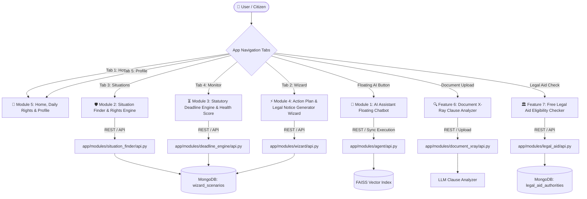

# 🏛️ LegalAce — Full System Architecture & Technical Reference

**LegalAce** is a full-stack, AI-powered citizen legal assistant built specifically for the Indian Legal System. It translates complex Indian statutes (IPC/BNSS, CrPC, Consumer Protection Act, RERA, NI Act, Model Tenancy Act, Labour Laws, NALSA Act) into plain-English rights, interactive action blueprints, advocate-grade legal notice generation, statutory deadline monitoring, contract X-Ray analysis, and free legal aid eligibility checking.

---

## 🛠️ Global Technology Stack

| Layer | Technologies & Frameworks | Key Responsibilities |
|---|---|---|
| **Frontend Core** | React (TypeScript), Vite, Vanilla CSS | Single-page application, custom mobile-friendly glassmorphism design system, zero external UI libraries. |
| **Speech & Media** | Web Speech Synthesis API, Browser Print Engine, html2pdf.js | Native offline Female/Young-Girl Text-to-Speech audio reader, A4 multi-page PDF generation engine. |
| **Backend API** | Python 3.10+, FastAPI, Uvicorn | High-performance async REST APIs, CORS middleware, strict Pydantic request & response schemas. |
| **AI / LLM Engine** | LangChain ReAct Agent, RAG Pipeline, OpenAI / Gemini / Ollama | Context-aware legal agent tool execution, dynamic scenario generation, legal notice drafting. |
| **Vector Database** | SentenceTransformers (`all-MiniLM-L6-v2`), FAISS Index | 384-dimensional vector embeddings, flat inner-product vector search across Indian law statutory corpus. |
| **Database Layer** | MongoDB (Motor AsyncIOMotorClient) | Async document store for situations, limitation rules, wizard scenarios, bookmarks, deadlines, and chat logs. |

---

## 🧭 Architecture & Module Connection Diagram



---

## 📦 Detailed Breakdown of Core Modules

### 🤖 Module 1: AI Assistant & Floating Agentic Chatbot
* **Primary Role**: Conversational legal Q&A assistant with real-time reasoning transparency and human-in-the-loop pending action approvals.
* **Frontend Location**: [ChatbotTab.tsx](file:///c:/Projects/LegalAce/frontend/src/modules/chatbot/ChatbotTab.tsx) & [FloatingChatWidget.tsx](file:///c:/Projects/LegalAce/frontend/src/modules/chatbot/FloatingChatWidget.tsx)
* **Backend Location**: `backend/app/modules/agent/` (`api.py`, `executor.py`, `planner.py`, `tools.py`, `synthesizer.py`)

#### Key Features:
1. **Agentic Reasoning Trace**: Visualizes reasoning steps (*Deconstructing query -> Vector Search -> Building resolution plan*) for enhanced AI transparency.
2. **Pending Action Confirmation Cards**: Enables users to review and confirm high-impact actions (e.g. generating legal demand notices) directly in the chat interface.
3. **Conversational Legal Q&A**: Answers queries on Indian civil, criminal, labour, and consumer law using plain-English explanations.
4. **Expandable Law Citations**: Attaches IPC / CrPC / Act citations with expandable statutory summaries.

---

### 🛡️ Module 2: Situation Finder & Rights Engine
* **Primary Role**: Situation-first legal repository mapping human problems directly to rights, laws, and action steps.
* **Frontend Location**: [SituationFinderTab.tsx](file:///c:/Projects/LegalAce/frontend/src/modules/situation_finder/SituationFinderTab.tsx)
* **Backend Location**: `backend/app/modules/situation_finder/` (`api.py`, `service.py`)

#### Key Features:
1. **13 Core Legal Categories**: Covers Employment, Housing, Consumer Rights, Cyber Crime, Women Rights, Banking & Finance, Traffic Rules, Education, Cheque Bounce & Debt, RTI & Public Service, RERA Real Estate, Insurance, and Family Support.
2. **4-Pillar Action Blueprint**: Details User Rights, Action Steps, Statutory Law Citation Cards, and Urgency Warnings.
3. **Official Portals & Helplines Hub**: Telephone dial buttons (`15100`, `1915`, `1930`, `181`, `14567`) and links to official portals (`e-Daakhil`, `RTI Online`, `CyberCrime.gov.in`).
4. **Multilingual Voice Assist**: Offline Web Speech Synthesis reader with young-female voice pitch customization.

---

### ⏳ Module 3: Statutory Deadline Engine & Health Score
* **Primary Role**: Helps citizens track legal limitation periods under the Indian Limitation Act, 1963, calculate exact expiration dates, and monitor overall legal health.
* **Frontend Location**: [DeadlineDashboard.tsx](file:///c:/Projects/LegalAce/frontend/src/modules/deadline_engine/DeadlineDashboard.tsx)
* **Backend Location**: `backend/app/modules/deadline_engine/` (`api.py`, `service.py`, `extractor.py`, `scheduler.py`)

#### Key Features:
1. **Limitation Period Calculator**: Computes exact expiration dates, remaining days, and urgency status (*Normal*, *Urgent*, *Expired*).
2. **Health Score Ring (0–100)**: Visual gauge evaluating risk metrics based on pending, active, completed, and overdue legal deadlines.
3. **OTP WhatsApp & SMS Reminders**: Multi-channel reminder preferences with OTP verification workflows.
4. **ICS Calendar Export**: One-tap export to Google Calendar and Apple iCal.

---

### ⚡ Module 4: Action Plan & Legal Notice Generator Wizard
* **Primary Role**: Guides users through interactive decision trees to build custom Action Plans and generate printable, advocate-grade legal demand notices.
* **Frontend Location**: [WizardScreen.tsx](file:///c:/Projects/LegalAce/frontend/src/modules/wizard/WizardScreen.tsx)
* **Backend Location**: `backend/app/modules/wizard/` (`api.py`, `service.py`, `scenarios_data.py`)

#### Key Features:
1. **Multilingual Decision Trees**: Tailored question series in English, Tamil (`_ta`), and Hindi (`_hi`).
2. **AI Dynamic Scenario Generator**: Generates custom decision tree question nodes for non-standard user legal topics.
3. **Advocate-Grade PDF Notice Generator**: Drafts official Indian legal demand notices (*Security Deposit Recovery*, *Salary Recovery*, *Consumer Complaint*) with advocate, court, or corporate letterhead styling.

---

### 🔍 Feature 6: Document X-Ray Clause Analyzer
* **Primary Role**: Scans legal notices, rental contracts, and employment agreements to extract key dates, obligations, and red-flag clauses.
* **Frontend Location**: [DocumentXRayTab.tsx](file:///c:/Projects/LegalAce/frontend/src/modules/document_xray/DocumentXRayTab.tsx)
* **Backend Location**: `backend/app/modules/document_xray/` (`api.py`, `service.py`)

---

### 🏛️ Feature 7: Free Legal Aid Eligibility Checker
* **Primary Role**: Evaluates eligibility under NALSA Act Section 12 for free legal aid and connects citizens to their nearest DLSA/SLSA authority.
* **Frontend Location**: [LegalAidChecker.tsx](file:///c:/Projects/LegalAce/frontend/src/modules/legal_aid/LegalAidChecker.tsx)
* **Backend Location**: `backend/app/modules/legal_aid/` (`api.py`, `service.py`)

---

## 🔗 Cross-Module Integration Map

```
[ User Problem / Query ]
       │
       ├──────> Situation Finder ──────> View Rights, Statutory Laws & Helplines
       │                                       │
       │                           (Tap: "Start Action Plan")
       │                                       ▼
       ├──────> Interactive Wizard ────> Generate Action Blueprint & PDF Legal Notice
       │                                       │
       │                           (Extract Expiration Dates)
       │                                       ▼
       ├──────> Deadline Engine ───────> Track Expiration, Health Score & WhatsApp Alerts
       │
       ├──────> Document X-Ray ────────> Analyze Contracts & Extract Red Flags
       │
       ├──────> Free Legal Aid ────────> Check NALSA Eligibility & Nearest DLSA Office
       │
       └──────> Floating AI Chat ──────> Ask Questions & Confirm Pending Actions
```
