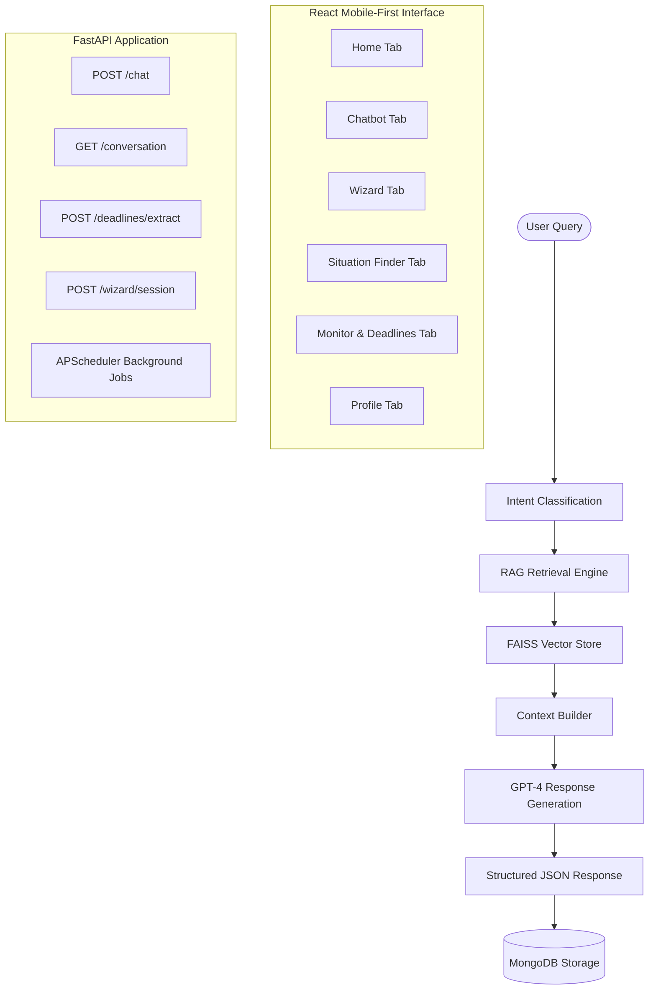

# LegalAce — AI Legal Companion for Indian Citizens

LegalAce is a robust, responsive web application designed as an AI-powered legal rights companion for Indian citizens. It provides actionable legal information, statutory rights mapping, interactive decision-tree guides (Wizards), legal document template generation, and a legal health monitor with deadline tracking.

---

## 🏗️ Architecture & Flow

---

## 🛠️ Technology Stack

| Layer | Technologies Used |
| :--- | :--- |
| **Frontend** | React (TypeScript), Vite, Vanilla CSS |
| **Backend API** | FastAPI, Uvicorn, Pydantic |
| **Database** | MongoDB (using Motor async driver) |
| **AI Embeddings** | HuggingFace `SentenceTransformers` (`all-MiniLM-L6-v2` loaded locally) |
| **Vector Index** | FAISS (Flat Inner Product index matching cosine similarity) |
| **LLM Orchestration** | OpenAI API client (running `gpt-4` model) |
| **Task Scheduling** | APScheduler (Advanced Python Scheduler) |

---

## 📦 Key Modules & Features

### 1. RAG Chatbot (`app.modules.chatbot`)
- **Intent Classification**: Uses `classify_intent` (regex keyword-matching + greeting/out-of-scope blacklists) to categorize queries into:
  - `employment`, `tenancy`, `consumer`, `criminal`, `family`, `property`, `banking`, `cyber_crime`, `traffic`, or `general_legal`.
- **Statutory Retrieval**: Encodes questions using the local SentenceTransformers model and runs a vector search on a local FAISS index compiled from `data/indian_law_corpus.json` (30 key Indian legal sections).
- **Elite AI Prompting & JSON Output**: Instructs GPT-4 to return structured JSON mapping an `answer`, a list of `rights`, list of `action_steps`, and relevant `law_citations`.
- **Robust Fail-Safe Fallbacks**: If the OpenAI key is invalid, quota-limited, or fails, the chatbot falls back to keyword-searching seeded situations or generating custom intent-based statutory answers based on local FAISS context.
- **Persistent History**: Saves multi-turn chats to MongoDB.

> [!NOTE]
> **Identified Bug**: In [prompt.py](file:///c:/Projects/LegalAce/backend/app/modules/chatbot/rag/prompt.py#L70-L85) inside `build_history_block`, the `return "\n".join(lines)` is indented inside the `for` loop, causing the chat system to only include the first chat message in context during multi-turn chats instead of the full history.

---

### 2. Situation Finder (`app.modules.situation_finder`)
- **Static Scenario Guides**: Pulls pre-compiled legal guides from the MongoDB `situations` collection.
- **Seeded Scenarios**: Populated by the script [seed_situations.py](file:///c:/Projects/LegalAce/backend/scripts/seed_situations.py), it includes **16 comprehensive scenario guides** across categories like:
  - **Employment**: Wrongful firing, unpaid salary withholding.
  - **Housing**: Security deposit recovery disputes, illegal eviction.
  - **Consumer**: Defective product refunds, e-commerce transaction fraud.
  - **Cyber Crime**: Phishing / OTP banking fraud, social media hacking/stalking.
  - **Women Rights**: Domestic violence, POSH Act workplace harassment.
  - **Banking**: Credit card fraud, debt recovery agent harassment.
  - **Traffic**: Stopped by traffic police, road accident liability rules.
  - **Education**: College fee refund denial, ragging/bullying.
- **Details Page**: Shows user rights, timelines, actions, and direct links to related laws.

---

### 3. Legal Health Monitor & Deadline Engine (`app.modules.deadline_engine`)
- **Interactive Tracking**: Users can create, snooze (snoozing extends the date by 7 days), complete, or delete deadlines.
- **AI-Powered Deadline Extractor**: Parses free-form text inputs or chat messages to extract structured deadlines. Uses GPT-4 or falls back to robust regex matching of relative days (e.g. "within 30 days") or calendar dates.
- **Legal Health Score**: Calculates a dynamic score (0–100) based on active, completed, upcoming, and expired deadlines.
- **APScheduler Background Jobs**:
  - `_job_expire_deadlines`: Automatically updates overdue deadlines as "expired" every 6 hours.
  - `_job_log_health_summary`: Logs system-wide diagnostic statistics daily at 8 AM IST.

---

### 4. What Should I Do? Wizard (`app.modules.wizard`)
- **Decision Trees**: Deterministic question series matching specific scenarios to identify a user's exact legal posture.
- **Multilingual Support**: Supports English, Tamil (`_ta`), and Hindi (`_hi`).
- **Plan Customization**: Generates a tailored step-by-step resolution plan and lists direct contact information for relevant Indian authorities (RBI Ombudsman, Consumer Court, NALSA, NCW, UGC Grievance, etc.).
- **Document Generator**: Generates clean, formatted Indian Legal Notice templates (such as a *Security Deposit Recovery Notice*, *Salary Recovery Notice*, or *Consumer Forum Complaint*) filled in with user-supplied details and financial claim itemization (calculating statutory interest at 12% p.a. + legal damages).

---

### 5. Profile & Settings (`app.modules.profile`)
- **Customizable Persona**: Identifies user as consumer, employee, tenant, business owner, or student.
- **State Selection**: Configures preferred state jurisdiction (e.g., Karnataka, Tamil Nadu, Maharashtra) to retrieve state-specific rules.
- **Local Data Portability**: Users can export their local bookmark/history profile payload as JSON or clear all search history and data.
