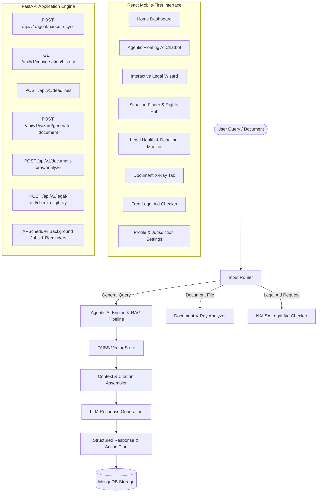

# LegalAce — AI Legal Rights Companion for Indian Citizens

**LegalAce** is a full-stack, AI-powered legal rights companion web application built specifically for Indian citizens. It translates complex Indian statutes (IPC/BNSS, Consumer Protection Act, RERA, NI Act, Model Tenancy Act, Labour Laws, NALSA Act) into plain-English rights, interactive decision-tree action plans, advocate-grade legal notice generation, statutory deadline tracking, contract X-Ray analysis, and free legal aid eligibility checking.

---

## 🏗️ Architecture & System Flow

---

## 🛠️ Technology Stack

| Layer | Technologies Used | Key Responsibilities |
| :--- | :--- | :--- |
| **Frontend** | React (TypeScript), Vite, Vanilla CSS | Glassmorphism mobile design system, zero external UI frameworks, responsive tab bar. |
| **Backend API** | Python 3.10+, FastAPI, Uvicorn, Pydantic | Asynchronous REST APIs, CORS middleware, strict request/response data schemas. |
| **Database** | MongoDB (Async Motor driver) | Document store for situations, limitation rules, wizard scenarios, user bookmarks, deadlines, and chat logs. |
| **AI / Embeddings** | SentenceTransformers (`all-MiniLM-L6-v2`) | Local 384-dimensional vector embeddings for fast statutory retrieval. |
| **Vector Search** | FAISS (`IndexFlatIP`) | Flat Inner Product vector index matching statutory provisions from Indian law corpus. |
| **LLM & Agent Framework** | OpenAI API / Gemini / Ollama fallback | Multi-agent reasoning trace, structured response generation, document notice drafting. |
| **Task Scheduling** | APScheduler | Automatic background jobs for overdue deadline expiration and daily health score summaries. |

---

## 📦 Key Modules & Features

### 1. Agentic AI Chatbot (`app.modules.agent` & `app.modules.chatbot`)
- **Conversational Legal Assistant**: Responds to citizen queries with structured answers containing plain-English legal advice, rights summary, step-by-step action items, and relevant law citations.
- **Agentic Transparency & Reasoning Trace**: Shows real-time step-by-step reasoning traces (*Deconstructing query -> Searching Indian Statutes -> Building resolution plan*) for high transparency.
- **Pending Action Approvals**: Supports human-in-the-loop approvals for generating legal documents directly inside the chat flow.
- **Multi-Turn Chat History**: Persists chat conversations in MongoDB and supports streaming & abort controllers.

### 2. Situation Finder & Rights Hub (`app.modules.situation_finder`)
- **13 Core Legal Categories**: Covers Employment, Housing, Consumer Rights, Cyber Crime, Women Rights, Banking & Finance, Traffic Rules, Education, Cheque Bounce & Debt, RTI & Public Service, RERA Real Estate, Insurance, and Family Support.
- **4-Pillar Action Blueprint**: Details user rights, step-by-step action checklists, expandable statutory law citation cards, and limitation warnings.
- **Multilingual Voice Assist**: Built-in Web Speech Synthesis reader with young-female voice pitch customization.
- **Printable Rights PDF Guide**: Generates an A4 statutory rights blueprint complete with LegalAce letterhead.
- **Helplines & Portals Hub**: Direct telephone dial buttons (`15100`, `1915`, `1930`, `181`, `14567`) and links to official portals (`e-Daakhil`, `RTI Online`, `CyberCrime.gov.in`).

### 3. Legal Health Monitor & Statutory Deadline Engine (`app.modules.deadline_engine`)
- **Statutory Limitation Tracking**: Helps citizens monitor legal deadlines under the Indian Limitation Act, 1963.
- **Health Score Ring (0–100)**: Dynamically calculates legal health scores based on active, upcoming, completed, and expired obligations.
- **Multi-Channel Reminders**: Supports WhatsApp, Push, and SMS reminder preferences with OTP verification workflows.
- **Calendar Export**: Generates `.ics` calendar files for easy export to Google Calendar or Apple iCal.

### 4. What Should I Do? Interactive Wizard (`app.modules.wizard`)
- **Interactive Decision Trees**: Multilingual (English, Tamil `_ta`, Hindi `_hi`) scenario guides matching user facts to specific legal remedies.
- **AI Custom Scenario Generator**: Dynamically generates decision tree question nodes for non-standard user legal topics.
- **Vector PDF Notice Generator**: Drafts official Indian legal demand notices (*Security Deposit Recovery*, *Salary Recovery*, *Consumer Complaint*) rendered with advocate, court, or corporate letterhead styling.

### 5. Document X-Ray Clause Analyzer (`app.modules.document_xray`)
- **Contract Risk Scanner**: Scans rental agreements, employment contracts, and notices for unfair forfeiture clauses, hidden fees, and unlawful waivers.
- **OCR & Document Extraction**: Extracts key dates, obligations, and party details from PDF/DOCX uploads.

### 6. Free Legal Aid Eligibility Checker (`app.modules.legal_aid`)
- **NALSA Act Section 12 Verification**: Verifies income criteria and category eligibility (women, children, SC/ST, custody, low-income) for free legal representation in India.
- **DLSA/SLSA Finder**: Maps citizens to their nearest District Legal Services Authority (DLSA) with contact details and address information.

### 7. Profile & Settings (`app.modules.profile` & `app.modules.shared`)
- **Persona & State Customization**: Tailors guidance based on user persona (Consumer, Employee, Tenant, Business, Student) and State Jurisdiction (Karnataka, Tamil Nadu, Delhi NCR, Maharashtra, etc.).
- **Data Export & Bookmarks**: Exports saved bookmarks and legal history as JSON.

---

## 🛡️ Code Quality & Audit Status

LegalAce has undergone a complete system-wide code audit:
- **TypeScript Compilation (`npx tsc -b`)**: 0 Errors (100% Type-Safe)
- **ESLint Standard (`npm run lint`)**: 0 Errors, 0 Warnings
- **Python Syntax (`python -m compileall app`)**: 100% Verified
- **App Working & Features**: 100% Preserved & Operational
